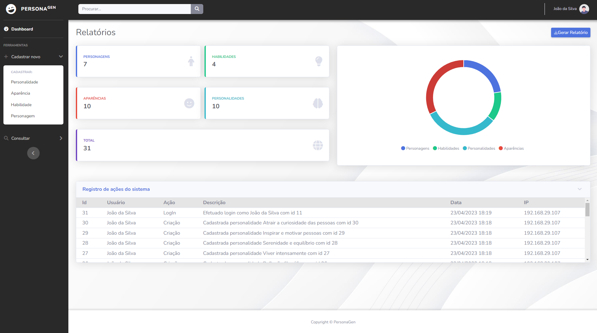
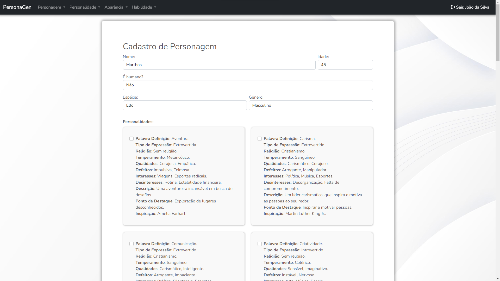

# PersonaGen
#### Aplicação web voltada para a geração e gerenciamento de personas e/ou personagens para livros, jogos de RPG, filmes, ou outras obras criativas.

##### Web application aimed at generating and managing personas and/or characters for books, role-playing games, movies, or other creative works.

## Demo

## Execução

Lembre-se de conectar a aplicação a seu banco de dados através do arquivo application.properties, ou utilize um banco de dados local conforme o endereço já inserido. Para desenvolvimento, foi utilizado o XAMPP com MySQL.
